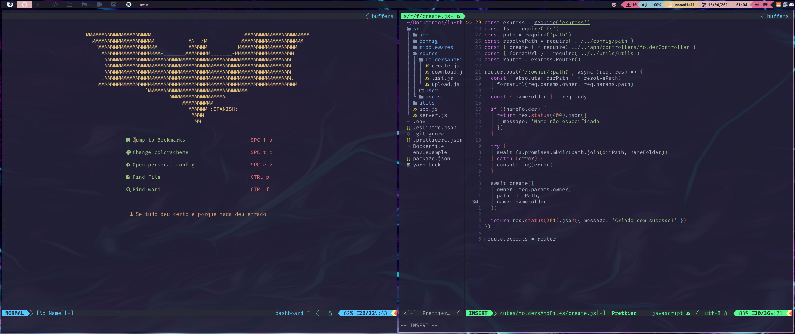

 :wrench:
 :package:
 :keyboard:NEOVIM configs

> Mis configuraciones para [neo**vim**](https://github.com/neovim/neovim)



## :white_flag: Idioma
- :es:/:peru: Español
- [:brazil: Portugues](./README.md)

## :wrench: Instalación

Para usar esta configuración executa

```bash
bash <(curl -s https://raw.githubusercontent.com/the-spanish-guy/dotfiles/master/.config/nvim/install.sh)
```

## :package: Lista de plugins

- [Nvim-web-devicons](https://github.com/kyazdani42/nvim-web-devicons)
- [Nvim-tree](https://github.com/kyazdani42/nvim-tree.lua) (funciona con neovim-nightly)
- [Auto Pairs](https://github.com/jiangmiao/auto-pairs)
- [CoC](https://github.com/neoclide/coc.nvim)
- [Asynchronous Lint Engine](https://github.com/dense-analysis/ale)
- [Rainbow Parentheses](https://github.com/junegunn/rainbow_parentheses.vim)
- [colorizer.lua](https://github.com/norcalli/nvim-colorizer.lua)
- [indentLine](https://github.com/Yggdroot/indentLine)
- [vim-airline](https://github.com/vim-airline/vim-airline)
- [vim-airline-themes](https://github.com/vim-airline/vim-airline-themes)
- [Oceanic Material](https://github.com/glepnir/oceanic-material)
- [vim-material](https://github.com/hzchirs/vim-material)
- [Onedark](https://github.com/joshdick/onedark.vim)
- [✨ Markdown Preview for (Neo)vim ✨](https://github.com/iamcco/markdown-preview.nvim)
- [goyo](https://github.com/junegunn/goyo.vim)
- [NERD Commenter](https://github.com/preservim/nerdcommenter)
- [fzf :heart: vim](https://github.com/junegunn/fzf.vim)
- [Dashboard](https://github.com/glepnir/dashboard-nvim)
- [Vim devicons](https://github.com/ryanoasis/vim-devicons)

## :keyboard: Keybindings

> let mapleader="\<space>"

| Atalho               | Ação                                                                     |
| -------------------- | :----------------------------------------------------------------------- |
| ctrl + p             | Busca por una palabra dentro de los archivos                             |
| ctrl + f             | Busca un archivo por su nombre                                           |
| ctrl + a             | Selecciona todo el contenido del archivo                                 |
| `<leader>` + y       | Copia(`ctrl+c`) el contenido seleccionado                                |
| ctrl + j             | Laza la terminal                                                         |
| alt + h              | ← Mueve el cursor del ratón para la ventana izquierda                    |
| alt + l              | → Mueve el cursor del ratón para la ventana derecha                      |
| alt + k              | ↑ Mueve el cursor del ratón para la ventana de arriba                    |
| alt + j              | ↓ Mueve el cursor del ratón para la ventana de abajo                     |
| alt + Arrow-Up (↑)   | Mueve el trozo de codigo seleccionado o la linea selecionada para arriba |
| alt + Arrow-Down (↓) | Mueve el trozo de codigo seleccionado o la linea selecionada para abajo  |
| ctrl + b             | Abre el explorador de archivos (Nvim-Tree)                               |
| `<leader>` + e       | Abre el explorador de archivos (coc-explorer)                            |

---

Hecho por [the spanish guy](https://github.com/the-spanish-guy) con :purple_heart:
