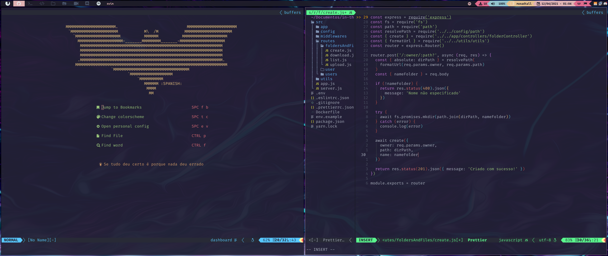

# NEOVIM configs

> Minhas configurações para o [neo**vim**](https://github.com/neovim/neovim)



## :speech_balloon: Idioma
- [:peru: Español](./README.es.md)
- :brazil: Portugues

## :wrench: Instalação

- Instalação via script via script

```bash
bash <(curl -s https://raw.githubusercontent.com/the-spanish-guy/dotfiles/master/.config/nvim/install.sh)
```

## :package: Lista de plugins

- [Nvim-web-devicons](https://github.com/kyazdani42/nvim-web-devicons)
- [Nvim-tree](https://github.com/kyazdani42/nvim-tree.lua) (need neovim-nightly)
- [Auto Pairs](https://github.com/jiangmiao/auto-pairs)
- [CoC](https://github.com/neoclide/coc.nvim)
- [Asynchronous Lint Engine](https://github.com/dense-analysis/ale)
- [Rainbow Parentheses](https://github.com/junegunn/rainbow_parentheses.vim)
- [colorizer.lua](https://github.com/norcalli/nvim-colorizer.lua)
- [indentLine](https://github.com/Yggdroot/indentLine)
- [vim-airline](https://github.com/vim-airline/vim-airline)
- [vim-airline-themes](https://github.com/vim-airline/vim-airline-themes)
- [Oceanic Material](https://github.com/glepnir/oceanic-material)
- [vim-material](https://github.com/hzchirs/vim-material)
- [Onedark](https://github.com/joshdick/onedark.vim)
- [✨ Markdown Preview for (Neo)vim ✨](https://github.com/iamcco/markdown-preview.nvim)
- [goyo](https://github.com/junegunn/goyo.vim)
- [NERD Commenter](https://github.com/preservim/nerdcommenter)
- [fzf :heart: vim](https://github.com/junegunn/fzf.vim)
- [Dashboard](https://github.com/glepnir/dashboard-nvim)
- [Vim devicons](https://github.com/ryanoasis/vim-devicons)

## :keyboard: Keybindings

> let mapleader="\<space>"

| Atalho               | Ação                                                                         |
| -------------------- | :--------------------------------------------------------------------------- |
| ctrl + p             | Pesquisa pela palavra dentro dos arquivos                                    |
| ctrl + f             | Pesquisa um arquivo pelo nome informado                                      |
| ctrl + a             | Seleciona todo o conteúdo do arquivo                                         |
| `<leader>` + y       | Copia o conteúdo selecionado para a área externa                             |
| ctrl + j             | Abre o terminal                                                              |
| alt + h              | ← Move o cursor para a janela esquerda                                       |
| alt + l              | → Move o cursor para a janela direita                                        |
| alt + k              | ↑ Move o cursor para a janela de cima                                        |
| alt + j              | ↓ Move o cursor para a janela de baixo                                       |
| alt + Arrow-Up (↑)   | Move o trecho de código selecionado ou a linha onde o cursor esta para cima  |
| alt + Arrow-Down (↓) | Move o trecho de código selecionado ou a linha onde o cursor esta para baixo |
| ctrl + b             | Abre o explorador de arquivos (Nvim-Tree)                                    |
| `<leader>` + e       | Abre o explorador de arquivos (coc-explorer)                                 |

---

Feito por [the spanish guy](https://github.com/the-spanish-guy) com :purple_heart:
