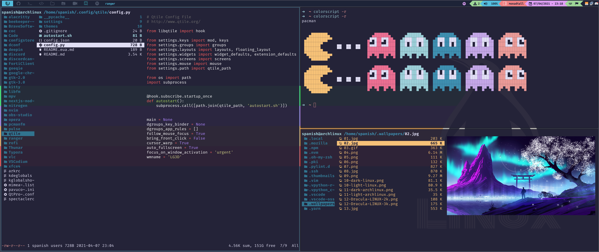

# Qtile



**Idioma**

> Algumas configurações foram pegas deste <a href="https://github.com/antoniosarosi/dotfiles" target="_blank">repositorio</a> mas foram modificadas conforme meu uso

- [:us: English](./README.eua.md)
- :brazil: Portugues

## Instalação

Instalando Qtile e algumas dependencias

```
sudo pacman -S qtile pacman-contrib noto-fonts-cjk noto-fonts-emoji
yay -S nerd-fonts-fira-code
pip install psutil
```

Clone o repositorio com as minhas configurações

```bash
git clone https://github.com/the-spanish-guy/dotfiles
cp -r dotfiles/.config/qtile ~/.config
```

Se preferir, pode ir testando com **[Xephyr](https://wiki.archlinux.org/index.php/Xephyr)**:

```bash
Xephyr -br -ac -noreset -screen 1280x720 :1 &
DISPLAY=:1 qtile
```

## :file_folder: Folder Structure

```
qtile
│   config.json
│   config.py
│
│
└───settings
│   │
│   | widgets.py
│   | themes.py
│   | screen.py
│   |
│   | ...
|
|
└───themes
│   │   ith.json
│   │   rosepine.json
│   │   nord.json
│   │   ...
```

### :open_file_folder: Settings

Aqui é onde ficam as configurações do qtile

  <details>
    <summary>Widgets</summary>
    Aqui os widgets do qtile, tais como o controle de volume, data, teclado, etc.
  </details>

  <details>
    <summary>Theme</summary>
    Um simples gerenciador de tema, a função dele é abrir o arquivo <code>config.json</code> pegar o nome do tema, procurar ele na pasta <code>themes</code> e carregar o tema.
  </details>

  <details>
    <summary>Screens</summary>
    simples script para verificar a disponibilidade de mais de um monitor.
  </details>

  <details>
    <summary>Path</summary>
    Irá carregar a pasta de configurações do qtile.
  </details>

  <details>
    <summary>Mouse</summary>
    Configurações para alguns clicks do mouse
    <ul>
      <li>
        [MOD] + click direito: poderá redimensionar a janela aberta/ativa.
      </li>
      <li>
        [MOD] + click esquerdo: poderá mover a janela aberta/ativa.
      </li>
    </ul>
  </details>

  <details>
    <summary>Layouts</summary>
      Uma breve configuração da disposições dos items como, margin, border, posição da barra de menu horizontal ou vertical entre outras coisas.
  </details>

  <details>
    <summary>Keys</summary>
      ALgumas <code>keybindings</code> que tenho configuradas como: 
    <ul>
      <li>
        abrir o terminal com <code>[MOD] + return</code>
      </li>
      <li>
        alternar entre diferentes layouts com <code>[MOD] + tab</code> ou <code>[MOD] + Shift-Tab</code>
      </li>
    </ul>
    entre outros atalhos
  </details>

  <details>
    <summary>Groups</summary>
      Aqui são definidos os ícones que cada layout irá ter, e como trocar de workspace caso esteja trablhando com mais monitores
  </details>

### :open_file_folder: Themes

Aqui são definidos os arquivos de temas do qtile, para saber mais [clique aqui](./themes/README.md)

### :pencil: config.json

Aqui você define um tema, para definir um tema, verifique se o mesmo esta disponível na pasta `./themes` e escreva o nome do tema desejado no arquivo `./config.json`

```json
{
  "theme": "ith"
}
```

### :pencil: config.py

Em `config.py`, é o arquivo normalmente escrevem as suas configurações,
Aqui tem apenas uma função _autostart_ e algumas outras variáveis como _cursor_warp_ (_quanto true ele ativa a janela em que o mouse esta focando_).

### :pencil: autostart.sh

Caso queira mudar alguns programas inicializados no `autostart.sh` basta abrir o mesmo e editar

### Keybinding

#### Ações do qtile

| Atalho                | Ação                                                    |
| --------------------- | :------------------------------------------------------ |
| [mod] + j             | Foca a janela anterior                                  |
| [mod] + k             | Foca a próxima janela                                   |
| [mod] + shift + h     | Diminui o tamanho da janela atual                       |
| [mod] + shift + l     | Aumenta o tamanho da janela atual                       |
| [mod] + shift + j     | Move a janela atual para baixo                          |
| [mod] + shift + k     | Move a janela atual para cima                           |
| [mod] + shift + f     | Deixa a janela atual flutuante                          |
| [mod] + tab           | Troca a disposição das janelas                          |
| [mod] + shift + tab   | Volta uma disposição da janela                          |
| [mod] + [1-9]         | Troca o espaço de trabalho atual                        |
| [mod] + shift + [1-9] | Manda a janela atual para o espaço de trabalho desejado |
| [mod] + w             | Fecha a janela atual                                    |
| [mod] + ctrl + r      | Reinicia o qtile                                        |
| [mod] + ctrl + q      | Termina a sessão                                        |

#### Atalhos customizados

> Os atalhos abaixo só irão funcionar se tiver os programas em questão

```shell
sudo pacman -S rofi thunar brave alacritty redshift spectacle
```

| Atalho                | Ação                                                             |
| --------------------- | :--------------------------------------------------------------- |
| [mod] + m             | Abre o rofi                                                      |
| [mod] + shift + m     | Inicia o rofi no modo                                            |
| [mod] + b             | Inicia o navegador (Brave)                                       |
| [mod] + e             | Abre o explorador de arquivos (Thunar)                           |
| [mod] + shift + e     | Abre o explorador de arquivos (Ranger)                           |
| [mod] + return        | Abre o terminal (Alacritty)                                      |
| [mod] + r             | Inicia [redshift](https://wiki.archlinux.org/index.php/redshift) |
| [mod] + shift + r     | Para o [redhsift](https://wiki.archlinux.org/index.php/redshift) |
| Print                 | Obtem um printscreen da tela                                     |
| [mod] + shift + Print | Abre o spectacle para selecionar onde será feito o printscreen   |

---

Feito por [the spanish guy](https://github.com/the-spanish-guy) com :purple_heart:
