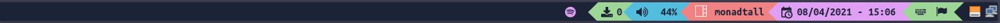

O tema consiste em um arquivo json igual mostrado abaixo.<br>
Caso queira criar um novo, basta copiar o template abaixo, e substituir pelas cores de sua preferência.


```json
{
    "dark": [
        "#1B2135",
        "#1B2135"
    ],
    "grey": [
        "#CCD8EC",
        "#CCD8EC"
    ],
    "light": [
        "#ffffff",
        "#ffffff"
    ],
    "text": [
        "#1B2135",
        "#1B2135"
    ],
    "focus": [
        "#54C4E4",
        "#54C4E4"
    ],
    "active": [
        "#295e6e",
        "#295e6e"
    ],
    "inactive": [
        "#4c566a",
        "#4c566a"
    ],
    "urgent": [
        "#F98585",
        "#F98585"
    ],
    "color1": [
        "#e8a4fc",
        "#e8a4fc"
    ],
    "color2": [
        "#F98585",
        "#F98585"
    ],
    "color3": [
        "#54C4E4",
        "#54C4E4"
    ],
    "color4": [
        "#A3DE9A",
        "#A3DE9A"
    ]
}

```
As cores definidas acima é referente ao [ith](./ith.json)


