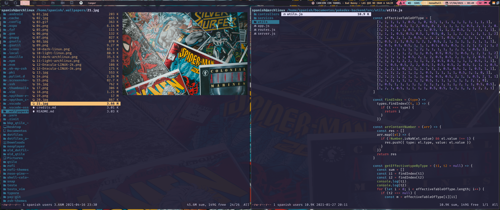

# Ranger



## :speech_balloon: Idioma

- :peru: Español
- [:brazil: Português](https://github.com/the-spanish-guy/dotfiles/tree/master/.config/ranger#readme)
- [:us: English](./README.us.md)

## :wrench: Instalación 

> Para más opciones [verifique aqui](https://github.com/ranger/ranger#installing)

- Python

```bash
pip3 install ranger-fm
```

- Yay

```bash
yay -S ranger
```

copia los archivos a `~/.config/ranger`

```bash
cp rc.conf install.sh ~/.config/ranger
```

## :ringed_planet: Iconos

Para instalar los iconos, ejecuta

> Para otras opciones de [instalacion](https://github.com/alexanderjeurissen/ranger_devicons#install-instructions)

```bash
chmod +x ./install.sh
./install.sh
```

## :milky_way: Imagenes

```bash
sudo pip3 install ueberzug
```

---

Hecho por [the spanish guy](https://github.com/the-spanish-guy) con :purple_heart:
